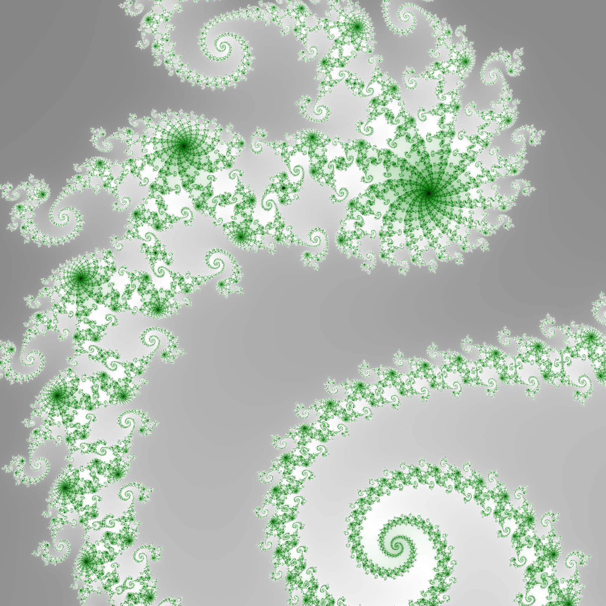

# python-course-project
Python Mandelbrot set visualizer

---

## Features

### Matplotlib Rendering
-   **Modes:**
    -   Square pixels
    -   Dots
-   **Adjustable density:** Controls how many points are plotted.

### Pillow Rendering
-   **Black & White:** Standard black-and-white rendering.
-   **Color:**
    -   Gray gradient
    -   Matplotlib color palettes
    -   Edge emphasis
    -   Custom gradients
    -   HSB-based coloring
-   **Zoom Control:** Specify the width of the area to display.
-   **Auto-Iterations:** Iteration depth is automatically calculated.

### Other Features
-   Save images of generated fractals.

---

## Example Output



---

## Dependencies

The project uses the following Python libraries:

-   [NumPy](https://numpy.org)
-   [Matplotlib](https://matplotlib.org)
-   [Pillow (PIL)](https://python-pillow.org)

---

## Installation

1.  **Install Python 3.x**  
    Make sure Python 3 is installed on your system.

2.  **Clone the repository**  
    ```bash
    git clone https://github.com/YOUR_USERNAME/python-course-project.git
    cd python-course-project
    ```

3.  **Install dependencies**  
    ```bash
    pip install -r requirements.txt
    ```
    *Note: The `requirements.txt` file lists all necessary Python packages (`numpy`, `matplotlib`, `Pillow`) for this project.*

---

## How to Run

Run the main program:
```bash
python main.py
```
The program will prompt you to choose a rendering option. **Enter the corresponding number for your choice.**
-   **Matplotlib Rendering:**
    -   Choose between **square pixels** or **dots** by entering the corresponding number.
    -   Adjust the **density** of points plotted.
-  **Pillow Rendering:**
    -   Choose **black & white** or **color** by entering the corresponding number.
    -   For **color mode**, additional options include gray gradient, matplotlib color palettes, edge emphasis, custom gradients, and HSB-based coloring.
    -   Specify the **width of the area** to display (controls “zoom”).
    -   **Iterations** are automatically calculated.

## Notes

-   Intended for learning and experimentation
-   Contributions are welcome
-   Inspired by mathematical exploration of fractals

---

## References & Acknowledgments
-   This project started from [Real Python: Draw the Mandelbrot Set in Python](https://realpython.com/mandelbrot-set-python/) (original school project).
-   Portions of the code, especially for integration with numpy and rendering, were developed with guidance from ChatGPT and Google AI tools.
-   The final implementation and additional features were written and adapted by the author.
